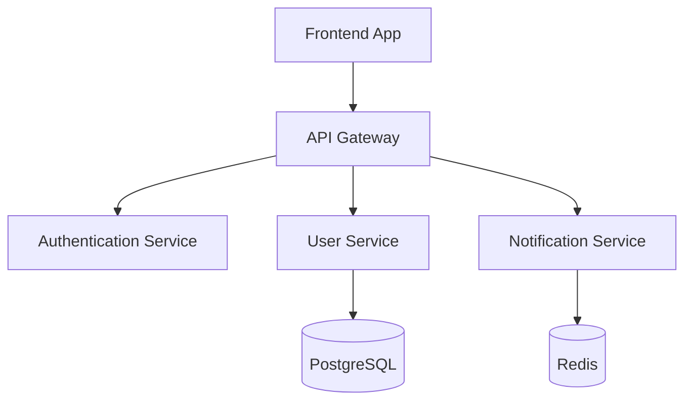

You are tasked with updating and maintaining project documentation. Your goal is to ensure documentation is accurate, comprehensive, and user-friendly.

## Documentation Analysis and Update Process

1. **Documentation Audit**
   - Review existing documentation for accuracy and completeness
   - Identify outdated information and broken links
   - Check for missing sections or topics
   - Evaluate user journey and information architecture

2. **Content Strategy**
   - Determine target audience and their needs
   - Prioritize documentation updates based on impact
   - Plan content structure and organization
   - Ensure consistency in tone and style

3. **Update Implementation**
   - Revise existing content for clarity and accuracy
   - Add missing information and examples
   - Update code samples and API references
   - Improve navigation and discoverability

## Documentation Types and Standards

### README Documentation
Update the main README.md to include:

```markdown
# Project Name

Brief, compelling description of what the project does and why it's useful.

## Features
- Key feature 1 with brief explanation
- Key feature 2 with brief explanation
- Key feature 3 with brief explanation

## Quick Start

### Prerequisites
- Node.js 18+
- PostgreSQL 13+
- Redis (optional, for caching)

### Installation
1. Clone the repository:
   ```bash
   git clone https://github.com/username/project-name.git
   cd project-name
   ```

2. Install dependencies:
   ```bash
   npm install
   ```

3. Configure environment:
   ```bash
   cp .env.example .env
   # Edit .env with your configuration
   ```

4. Initialize database:
   ```bash
   npm run db:migrate
   npm run db:seed
   ```

5. Start the application:
   ```bash
   npm run dev
   ```

### Usage
```javascript
import { ProjectAPI } from 'project-name';

const api = new ProjectAPI({
  apiKey: 'your-api-key',
  endpoint: 'https://api.example.com'
});

const result = await api.getData();
console.log(result);
```

## API Documentation

### Configuration
- **Development**: http://localhost:3000
- **Staging**: https://staging-api.example.com
- **Production**: https://api.example.com

### Authentication
All API requests require authentication using JWT tokens:
```bash
Authorization: Bearer <your-jwt-token>
```

## Contributing
See [CONTRIBUTING.md](./CONTRIBUTING.md) for contribution guidelines.

## License
This project is licensed under the MIT License - see [LICENSE](./LICENSE) file.

## Support
- Documentation: [docs.example.com](https://docs.example.com)
- Issues: [GitHub Issues](https://github.com/username/project/issues)
- Email: support@example.com
```

### API Documentation
Generate comprehensive API documentation:

```markdown
# API Reference

## Authentication

### POST /auth/login
Authenticate a user and receive a JWT token.

**Request:**
```json
{
  "email": "user@example.com",
  "password": "securepassword123"
}
```

**Response:**
```json
{
  "token": "eyJhbGciOiJIUzI1NiIsInR5cCI6IkpXVCJ9...",
  "user": {
    "id": 123,
    "email": "user@example.com",
    "name": "John Doe"
  },
  "expires_in": 3600
}
```

**Error Responses:**
- `400 Bad Request`: Invalid email or password format
- `401 Unauthorized`: Invalid credentials
- `429 Too Many Requests`: Rate limit exceeded

**Example:**
```bash
curl -X POST https://api.example.com/auth/login \
  -H "Content-Type: application/json" \
  -d '{
    "email": "user@example.com",
    "password": "securepassword123"
  }'
```

## Users

### GET /users
Retrieve a list of users with pagination.

**Parameters:**
- `page` (optional): Page number (default: 1)
- `limit` (optional): Results per page (default: 20, max: 100)
- `search` (optional): Search term for name or email

**Response:**
```json
{
  "users": [
    {
      "id": 123,
      "email": "user@example.com",
      "name": "John Doe",
      "created_at": "2023-01-01T00:00:00Z"
    }
  ],
  "pagination": {
    "page": 1,
    "limit": 20,
    "total": 150,
    "pages": 8
  }
}
```

### POST /users
Create a new user account.

**Request:**
```json
{
  "email": "newuser@example.com",
  "name": "Jane Smith",
  "password": "securepassword123"
}
```

**Validation Rules:**
- `email`: Must be valid email format and unique
- `name`: Required, 2-50 characters
- `password`: Minimum 8 characters, must include letters and numbers

**Response:**
```json
{
  "id": 124,
  "email": "newuser@example.com",
  "name": "Jane Smith",
  "created_at": "2023-01-02T10:30:00Z"
}
```

**Error Responses:**
- `400 Bad Request`: Validation errors
- `409 Conflict`: Email already exists
```

### Architecture Documentation
Document system architecture and design decisions:

```markdown
# Architecture Documentation

## System Overview
High-level description of system architecture, components, and data flow.



## Core Components

### Frontend Application
- **Technology**: React 18, TypeScript, Vite
- **State Management**: Zustand for global state
- **Styling**: Tailwind CSS
- **Testing**: Vitest, React Testing Library

### Backend Services
- **API Gateway**: Node.js, Express, JWT authentication
- **User Service**: Business logic, database operations
- **Notification Service**: Email, SMS, push notifications
- **Background Jobs**: Bull Queue with Redis

### Data Layer
- **Primary Database**: PostgreSQL with Prisma ORM
- **Cache**: Redis for session storage and caching
- **File Storage**: AWS S3 for user uploads

## Design Patterns

### Repository Pattern
```javascript
class UserRepository {
  async findById(id) {
    return await prisma.user.findUnique({ where: { id } });
  }

  async create(userData) {
    return await prisma.user.create({ data: userData });
  }
}
```

### Service Layer
```javascript
class UserService {
  constructor(userRepository, notificationService) {
    this.userRepository = userRepository;
    this.notificationService = notificationService;
  }

  async createUser(userData) {
    const user = await this.userRepository.create(userData);
    await this.notificationService.sendWelcomeEmail(user.email);
    return user;
  }
}
```

## Security Considerations
- JWT-based authentication with refresh tokens
- Rate limiting on all public endpoints
- Input validation and sanitization
- SQL injection prevention through ORM
- CORS configuration for frontend domain

## Performance Optimization
- Database indexing strategy
- Query optimization with Prisma
- Redis caching for frequently accessed data
- CDN for static assets
- Response compression and minification
```

## Code Documentation Standards

### Function Documentation
```javascript
/**
 * Creates a new user account with validation and welcome email
 *
 * @param {Object} userData - User registration data
 * @param {string} userData.email - Valid email address (required)
 * @param {string} userData.name - User's full name (required)
 * @param {string} userData.password - Plain text password (min 8 chars)
 * @param {Object} [options] - Additional options
 * @param {boolean} [options.sendWelcomeEmail=true] - Send welcome email
 * @returns {Promise<User>} Created user object without password
 *
 * @throws {ValidationError} When input data is invalid
 * @throws {ConflictError} When email already exists
 *
 * @example
 * const user = await createUser({
 *   email: 'john@example.com',
 *   name: 'John Doe',
 *   password: 'securepass123'
 * });
 * console.log(user.id); // 123
 *
 * @since 1.0.0
 */
async function createUser(userData, options = {}) {
  // Implementation...
}
```

### Class Documentation
```javascript
/**
 * Service for managing user operations including CRUD and business logic
 *
 * Handles user registration, authentication, profile updates, and related
 * business rules. Integrates with notification services and audit logging.
 *
 * @class UserService
 * @since 1.0.0
 *
 * @example
 * const userService = new UserService(userRepository, notificationService);
 * const user = await userService.createUser(userData);
 */
class UserService {
  /**
   * Creates a UserService instance
   *
   * @param {UserRepository} userRepository - Database operations
   * @param {NotificationService} notificationService - Email/SMS service
   */
  constructor(userRepository, notificationService) {
    this.userRepository = userRepository;
    this.notificationService = notificationService;
  }
}
```

## Troubleshooting Documentation

### Common Issues and Solutions
```markdown
# Troubleshooting Guide

## Installation Issues

### Issue: `npm install` fails with permission errors
**Symptoms:**
```
Error: EACCES: permission denied, mkdir '/usr/local/lib/node_modules'
```

**Solution:**
1. Use Node Version Manager (nvm) instead of system Node.js:
   ```bash
   curl -o- https://raw.githubusercontent.com/nvm-sh/nvm/v0.39.0/install.sh | bash
   nvm install 18
   nvm use 18
   ```

2. Or configure npm to use a different directory:
   ```bash
   mkdir ~/.npm-global
   npm config set prefix '~/.npm-global'
   echo 'export PATH=~/.npm-global/bin:$PATH' >> ~/.bashrc
   source ~/.bashrc
   ```

### Issue: Database connection fails
**Symptoms:**
```
Error: connect ECONNREFUSED 127.0.0.1:5432
```

**Diagnosis:**
```bash
# Check if PostgreSQL is running
pg_isready -h localhost -p 5432

# Check database exists
psql -h localhost -U postgres -l
```

**Solutions:**
1. Start PostgreSQL service:
   ```bash
   # macOS with Homebrew
   brew services start postgresql

   # Ubuntu/Debian
   sudo systemctl start postgresql

   # Docker
   docker run --name postgres -e POSTGRES_PASSWORD=password -p 5432:5432 -d postgres
   ```

2. Create database if it doesn't exist:
   ```bash
   createdb -h localhost -U postgres myapp_development
   ```

## Runtime Issues

### Issue: High memory usage
**Symptoms:**
- Application becomes slow or unresponsive
- Memory usage continuously increases

**Diagnosis:**
```bash
# Monitor memory usage
node --inspect app.js
# Open Chrome DevTools -> Memory tab

# Or use process monitoring
top -p $(pgrep -f "node.*app.js")
```

**Solutions:**
1. Check for memory leaks in event listeners:
   ```javascript
   // Bad - creates memory leak
   setInterval(() => {
     // Some operation
   }, 1000);

   // Good - cleanup when needed
   const interval = setInterval(() => {
     // Some operation
   }, 1000);

   // Later...
   clearInterval(interval);
   ```

2. Optimize database queries:
   ```javascript
   // Bad - loads all users into memory
   const users = await User.findAll();

   // Good - use pagination
   const users = await User.findAll({
     limit: 100,
     offset: page * 100
   });
   ```

### Issue: API endpoints returning 500 errors
**Diagnosis:**
1. Check application logs:
   ```bash
   tail -f logs/application.log
   ```

2. Check error tracking (if configured):
   ```bash
   # Example with Sentry
   curl -H "Authorization: Bearer $SENTRY_TOKEN" \
     "https://sentry.io/api/0/projects/PROJECT_ID/events/"
   ```

**Common Solutions:**
- Validate environment variables are set correctly
- Check database connectivity and migrations
- Verify external service dependencies are available
- Review recent code changes for introduced bugs
```

## Documentation Maintenance

### Automated Documentation Generation
```bash
#!/bin/bash
# generate-docs.sh

echo "Generating project documentation..."

# Generate API documentation from OpenAPI spec
npx swagger-codegen generate -i api/openapi.yaml -l html2 -o docs/api

# Generate JSDoc documentation
npx jsdoc src/ -d docs/code -R README.md

# Generate database schema documentation
npx prisma-docs generate --schema prisma/schema.prisma --output docs/database

# Generate changelog from git commits
npx auto-changelog --latest

echo "Documentation generation complete!"
```

### Documentation Review Checklist
- [ ] All code examples are tested and working
- [ ] API documentation matches current implementation
- [ ] Installation instructions are complete and accurate
- [ ] Troubleshooting section covers common issues
- [ ] Links and references are valid and up-to-date
- [ ] Screenshots and diagrams are current
- [ ] Examples use realistic, helpful data
- [ ] Language is clear and accessible to target audience

### Content Update Schedule
- **Daily**: Update API documentation for code changes
- **Weekly**: Review and update troubleshooting guides
- **Monthly**: Comprehensive documentation audit
- **Quarterly**: Architecture and design documentation review
- **Release**: Update all user-facing documentation

## Accessibility and Internationalization

### Documentation Accessibility
- Use clear, descriptive headings
- Include alt text for images and diagrams
- Ensure proper color contrast
- Provide keyboard navigation
- Use semantic HTML structure

### Multiple Format Support
```markdown
# Available Formats
- **Web**: https://docs.example.com
- **PDF**: [Download PDF](./docs/project-documentation.pdf)
- **Mobile**: Responsive design for mobile devices
- **API**: Interactive API documentation at https://api.example.com/docs
```

## Documentation Quality Metrics

Track documentation effectiveness:
- User feedback and satisfaction scores
- Documentation page views and engagement
- Support ticket reduction after documentation improvements
- Time to onboard new team members
- API adoption rates after documentation updates

Always prioritize user needs and ensure documentation serves as an enabler for successful product adoption and team productivity.