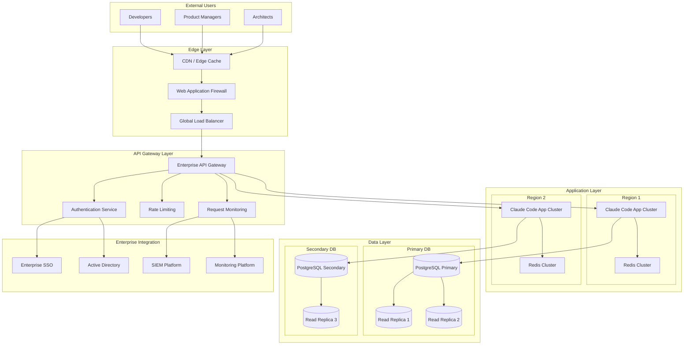

# Enterprise Architecture for Claude Code at Scale

A comprehensive reference architecture for deploying Claude Code across large enterprises with 500+ developers, multiple business units, and complex organizational structures.

## Overview

This enterprise architecture provides a scalable, secure, and manageable framework for Claude Code deployment that supports organizational complexity while maintaining performance, security, and governance requirements.

**Architecture Goals:**
- **Scalability**: Support 500-5000+ concurrent users
- **Performance**: Sub-200ms response times at enterprise scale
- **Security**: Enterprise-grade security and compliance
- **Governance**: Centralized policy with federated execution
- **Resilience**: 99.99% availability with disaster recovery

## Reference Architecture

### High-Level Architecture Diagram



## Infrastructure Components

### Edge and CDN Layer

```yaml
edge_infrastructure:
  cdn_configuration:
    provider: "enterprise_cdn_provider"
    global_presence: true
    edge_locations: 200+
    capabilities:
      - static_asset_caching
      - api_response_caching
      - ddos_protection
      - ssl_termination
      - compression
      - image_optimization

  waf_configuration:
    security_rules:
      - owasp_top_10_protection
      - custom_enterprise_rules
      - rate_limiting_per_ip
      - geographic_restrictions
      - bot_protection

    integration:
      - siem_log_forwarding
      - threat_intelligence_feeds
      - automated_response_actions

  global_load_balancer:
    algorithm: "geographic_proximity_with_health_checks"
    health_check_interval: "30_seconds"
    failover_time: "< 30_seconds"
    traffic_distribution:
      primary_region: "70%"
      secondary_region: "30%"
    disaster_recovery:
      automatic_failover: true
      rto: "5_minutes"
      rpo: "1_minute"
```

### API Gateway Layer

```json
{
  "api_gateway_architecture": {
    "deployment_model": "active_active_multi_region",
    "capacity": {
      "requests_per_second": 50000,
      "concurrent_connections": 100000,
      "data_throughput": "10_gbps"
    },
    "features": {
      "authentication": {
        "methods": ["saml", "oidc", "oauth2", "api_keys"],
        "mfa_integration": true,
        "session_management": "distributed"
      },
      "authorization": {
        "rbac": true,
        "abac": true,
        "policy_engine": "opa_integration",
        "fine_grained_permissions": true
      },
      "traffic_management": {
        "rate_limiting": {
          "per_user": "1000_requests_per_minute",
          "per_team": "10000_requests_per_minute",
          "per_organization": "100000_requests_per_minute"
        },
        "quotas": {
          "daily_limits": "configurable_per_tier",
          "burst_allowance": "20%_above_limit",
          "reset_policy": "rolling_window"
        },
        "circuit_breaker": {
          "failure_threshold": "5%",
          "timeout": "30_seconds",
          "recovery_time": "60_seconds"
        }
      }
    },
    "monitoring": {
      "metrics": [
        "request_rate",
        "response_time",
        "error_rate",
        "authentication_success_rate",
        "rate_limit_violations"
      ],
      "alerting": {
        "response_time_sla": "< 100ms_p95",
        "error_rate_threshold": "< 0.1%",
        "availability_target": "> 99.99%"
      }
    }
  }
}
```

### Application Layer Architecture

```yaml
application_layer:
  deployment_strategy: "microservices_with_api_gateway"

  core_services:
    claude_api_service:
      description: "Core Claude Code API functionality"
      instances: 20
      resources:
        cpu: "4_cores"
        memory: "8_gb"
        storage: "100_gb_ssd"
      scaling:
        min_instances: 10
        max_instances: 100
        target_cpu_utilization: "70%"
        scale_up_cooldown: "5_minutes"
        scale_down_cooldown: "15_minutes"

    user_management_service:
      description: "Enterprise user and permission management"
      instances: 10
      resources:
        cpu: "2_cores"
        memory: "4_gb"
        storage: "50_gb_ssd"
      scaling:
        min_instances: 5
        max_instances: 50
        target_cpu_utilization: "60%"

    audit_logging_service:
      description: "Comprehensive audit and compliance logging"
      instances: 8
      resources:
        cpu: "2_cores"
        memory: "6_gb"
        storage: "200_gb_ssd"
      scaling:
        min_instances: 4
        max_instances: 40
        target_memory_utilization: "80%"

    analytics_service:
      description: "Usage analytics and reporting"
      instances: 6
      resources:
        cpu: "4_cores"
        memory: "16_gb"
        storage: "500_gb_ssd"
      scaling:
        min_instances: 3
        max_instances: 30
        target_cpu_utilization: "70%"

  service_mesh:
    technology: "istio"
    features:
      - encrypted_inter_service_communication
      - traffic_routing_and_load_balancing
      - circuit_breaker_patterns
      - distributed_tracing
      - metrics_collection
      - security_policy_enforcement

  caching_layer:
    redis_cluster:
      topology: "cluster_mode_with_sharding"
      nodes: 9
      node_configuration:
        memory: "32_gb"
        persistence: "rdb_and_aof"
        backup_frequency: "hourly"
      cache_policies:
        user_sessions: "24_hours"
        api_responses: "5_minutes"
        configuration_data: "1_hour"
        frequently_accessed_data: "30_minutes"
```

### Data Layer Architecture

```markdown
## Data Architecture Strategy

### Primary Database Cluster
- **Technology**: PostgreSQL 15+ with enterprise extensions
- **Configuration**: Primary-replica setup with read scaling
- **Capacity**: 10TB storage, 1000 IOPS baseline, burstable to 10000 IOPS
- **Backup Strategy**: Continuous WAL archiving, daily full backups
- **Disaster Recovery**: Cross-region replication with automated failover

### Database Schema Design
```sql
-- User Management Schema
CREATE SCHEMA user_management;

CREATE TABLE user_management.organizations (
    id UUID PRIMARY KEY DEFAULT gen_random_uuid(),
    name VARCHAR(255) NOT NULL,
    domain VARCHAR(255) UNIQUE NOT NULL,
    settings JSONB,
    created_at TIMESTAMPTZ DEFAULT NOW(),
    updated_at TIMESTAMPTZ DEFAULT NOW()
);

CREATE TABLE user_management.business_units (
    id UUID PRIMARY KEY DEFAULT gen_random_uuid(),
    organization_id UUID REFERENCES user_management.organizations(id),
    name VARCHAR(255) NOT NULL,
    cost_center VARCHAR(100),
    settings JSONB,
    created_at TIMESTAMPTZ DEFAULT NOW(),
    updated_at TIMESTAMPTZ DEFAULT NOW()
);

CREATE TABLE user_management.teams (
    id UUID PRIMARY KEY DEFAULT gen_random_uuid(),
    business_unit_id UUID REFERENCES user_management.business_units(id),
    name VARCHAR(255) NOT NULL,
    team_lead_id UUID,
    settings JSONB,
    created_at TIMESTAMPTZ DEFAULT NOW(),
    updated_at TIMESTAMPTZ DEFAULT NOW()
);

CREATE TABLE user_management.users (
    id UUID PRIMARY KEY DEFAULT gen_random_uuid(),
    email VARCHAR(255) UNIQUE NOT NULL,
    employee_id VARCHAR(100),
    name VARCHAR(255) NOT NULL,
    team_id UUID REFERENCES user_management.teams(id),
    role VARCHAR(100) NOT NULL,
    status VARCHAR(50) DEFAULT 'active',
    last_login TIMESTAMPTZ,
    created_at TIMESTAMPTZ DEFAULT NOW(),
    updated_at TIMESTAMPTZ DEFAULT NOW(),

    -- Indexes for performance
    INDEX idx_users_email (email),
    INDEX idx_users_team_id (team_id),
    INDEX idx_users_status (status),
    INDEX idx_users_last_login (last_login)
);

-- Usage Analytics Schema
CREATE SCHEMA analytics;

CREATE TABLE analytics.usage_events (
    id UUID PRIMARY KEY DEFAULT gen_random_uuid(),
    user_id UUID REFERENCES user_management.users(id),
    session_id UUID,
    event_type VARCHAR(100) NOT NULL,
    event_data JSONB,
    timestamp TIMESTAMPTZ DEFAULT NOW(),
    ip_address INET,
    user_agent TEXT,

    -- Partitioning by month for performance
    PARTITION BY RANGE (timestamp)
);

-- Create monthly partitions
CREATE TABLE analytics.usage_events_y2024m01 PARTITION OF analytics.usage_events
    FOR VALUES FROM ('2024-01-01') TO ('2024-02-01');

-- Audit Schema
CREATE SCHEMA audit;

CREATE TABLE audit.audit_log (
    id UUID PRIMARY KEY DEFAULT gen_random_uuid(),
    user_id UUID,
    action VARCHAR(255) NOT NULL,
    resource_type VARCHAR(100),
    resource_id UUID,
    old_values JSONB,
    new_values JSONB,
    ip_address INET,
    user_agent TEXT,
    timestamp TIMESTAMPTZ DEFAULT NOW(),

    -- Partitioning by quarter for compliance
    PARTITION BY RANGE (timestamp)
);

-- Configuration Schema
CREATE SCHEMA configuration;

CREATE TABLE configuration.global_settings (
    key VARCHAR(255) PRIMARY KEY,
    value JSONB NOT NULL,
    description TEXT,
    updated_by UUID REFERENCES user_management.users(id),
    updated_at TIMESTAMPTZ DEFAULT NOW()
);

CREATE TABLE configuration.organization_settings (
    organization_id UUID REFERENCES user_management.organizations(id),
    key VARCHAR(255),
    value JSONB NOT NULL,
    updated_by UUID REFERENCES user_management.users(id),
    updated_at TIMESTAMPTZ DEFAULT NOW(),
    PRIMARY KEY (organization_id, key)
);
```

### Data Replication and Backup Strategy

```yaml
data_replication:
  primary_replica_setup:
    primary_database:
      location: "us-east-1"
      instance_type: "db.r6g.8xlarge"
      storage: "10TB_gp3"
      iops: "10000"
      multi_az: true

    read_replicas:
      replica_1:
        location: "us-east-1"
        lag_target: "< 100ms"
        instance_type: "db.r6g.4xlarge"

      replica_2:
        location: "us-west-2"
        lag_target: "< 500ms"
        instance_type: "db.r6g.4xlarge"

      replica_3:
        location: "eu-west-1"
        lag_target: "< 1s"
        instance_type: "db.r6g.4xlarge"

  backup_strategy:
    automated_backups:
      frequency: "every_6_hours"
      retention: "35_days"
      compression: "gzip"
      encryption: "aes_256"

    wal_archiving:
      frequency: "continuous"
      retention: "7_days"
      cross_region_copy: true

    snapshot_backups:
      frequency: "daily"
      retention: "1_year"
      lifecycle_policy: "transition_to_glacier_after_90_days"

  disaster_recovery:
    rpo: "15_minutes"
    rto: "1_hour"
    automated_failover: true
    cross_region_replication: true
    disaster_recovery_testing: "quarterly"
```

## Security Architecture

### Zero Trust Security Model

```json
{
  "zero_trust_architecture": {
    "identity_verification": {
      "user_authentication": {
        "primary_factor": "enterprise_sso",
        "mfa_required": true,
        "adaptive_authentication": "risk_based",
        "session_management": "jwt_with_refresh_tokens"
      },
      "device_verification": {
        "device_registration": "required",
        "certificate_based": true,
        "device_compliance_check": "continuous",
        "mobile_device_management": "integrated"
      },
      "application_verification": {
        "api_authentication": "oauth2_client_credentials",
        "service_to_service": "mutual_tls",
        "certificate_management": "automated_rotation"
      }
    },
    "network_security": {
      "micro_segmentation": {
        "network_policies": "kubernetes_network_policies",
        "service_mesh_security": "istio_security_policies",
        "east_west_encryption": "mandatory",
        "traffic_inspection": "deep_packet_inspection"
      },
      "perimeter_security": {
        "web_application_firewall": "enterprise_waf",
        "ddos_protection": "cloud_based_protection",
        "ip_allowlisting": "enterprise_ip_ranges",
        "geographic_restrictions": "configurable"
      }
    },
    "data_protection": {
      "encryption": {
        "data_at_rest": "aes_256_with_cmk",
        "data_in_transit": "tls_1_3_minimum",
        "field_level_encryption": "pii_fields",
        "key_management": "enterprise_hsm"
      },
      "access_controls": {
        "rbac": "fine_grained_permissions",
        "abac": "attribute_based_policies",
        "data_classification": "automated_tagging",
        "dlp": "data_loss_prevention_integrated"
      }
    }
  }
}
```

### Compliance and Audit Architecture

```yaml
compliance_architecture:
  audit_logging:
    comprehensive_logging:
      - user_authentication_events
      - api_access_logs
      - data_access_logs
      - configuration_changes
      - administrative_actions
      - security_events

    log_management:
      retention_period: "7_years"
      tamper_protection: true
      encryption: "aes_256"
      integrity_verification: "cryptographic_signatures"
      search_capabilities: "enterprise_search_platform"

    compliance_reporting:
      automated_reports:
        - soc2_quarterly_reports
        - gdpr_data_protection_reports
        - hipaa_security_reports
        - iso27001_control_assessments

      real_time_monitoring:
        - policy_violations
        - unusual_access_patterns
        - privilege_escalations
        - data_export_activities

  privacy_controls:
    data_governance:
      classification: "automated_pii_detection"
      retention_policies: "regulatory_compliance"
      right_to_be_forgotten: "automated_data_deletion"
      consent_management: "granular_consent_tracking"

    cross_border_data_transfer:
      data_residency_enforcement: true
      transfer_impact_assessments: "automated"
      adequacy_decisions: "maintained"
      binding_corporate_rules: "implemented"
```

## Monitoring and Observability

### Enterprise Monitoring Stack

```yaml
monitoring_architecture:
  observability_platform:
    metrics_collection:
      technology: "prometheus_federation"
      retention: "13_months"
      high_availability: "clustered_prometheus"
      alerting: "alertmanager_with_clustering"

    distributed_tracing:
      technology: "jaeger_enterprise"
      sampling_strategy: "adaptive_sampling"
      retention: "30_days"
      performance_impact: "< 1%"

    log_aggregation:
      technology: "elk_stack_enterprise"
      log_sources: [
        "application_logs",
        "system_logs",
        "security_logs",
        "audit_logs",
        "performance_logs"
      ]
      retention: "1_year_hot_7_years_cold"
      search_performance: "sub_second_queries"

    visualization:
      technology: "grafana_enterprise"
      dashboards: [
        "executive_overview",
        "operational_health",
        "security_monitoring",
        "business_metrics",
        "cost_analytics"
      ]
      alerting_integration: "multi_channel_notifications"

  key_performance_indicators:
    business_metrics:
      - user_adoption_rate
      - feature_utilization
      - productivity_improvements
      - cost_per_user
      - roi_calculations

    technical_metrics:
      - api_response_time_p95
      - system_availability
      - error_rate_by_service
      - database_performance
      - cache_hit_ratios

    security_metrics:
      - authentication_success_rate
      - authorization_failures
      - security_incidents
      - compliance_violations
      - threat_detection_accuracy
```

### Alerting and Incident Management

```json
{
  "alerting_framework": {
    "alert_hierarchy": {
      "critical": {
        "definition": "service_disrupting_issues",
        "response_time": "5_minutes",
        "escalation": [
          "immediate_phone_call",
          "executive_notification",
          "incident_response_team_activation"
        ],
        "examples": [
          "complete_service_outage",
          "data_breach_detected",
          "critical_security_vulnerability"
        ]
      },
      "high": {
        "definition": "performance_degradation_or_partial_outage",
        "response_time": "15_minutes",
        "escalation": [
          "sms_and_email",
          "team_lead_notification",
          "stakeholder_communication"
        ],
        "examples": [
          "high_error_rate",
          "slow_response_times",
          "authentication_service_issues"
        ]
      },
      "medium": {
        "definition": "potential_issues_requiring_attention",
        "response_time": "1_hour",
        "escalation": [
          "email_notification",
          "team_chat_channel"
        ],
        "examples": [
          "elevated_resource_usage",
          "unusual_traffic_patterns",
          "configuration_drift_detected"
        ]
      },
      "low": {
        "definition": "informational_alerts",
        "response_time": "next_business_day",
        "escalation": [
          "dashboard_notification",
          "daily_summary_report"
        ],
        "examples": [
          "routine_maintenance_reminders",
          "capacity_planning_alerts",
          "optimization_opportunities"
        ]
      }
    },
    "notification_channels": {
      "phone_calls": "critical_alerts_only",
      "sms": "high_and_critical_alerts",
      "email": "all_alert_levels",
      "slack": "team_specific_channels",
      "pagerduty": "escalation_management",
      "dashboard": "visual_status_indicators"
    }
  }
}
```

## Disaster Recovery and Business Continuity

### Multi-Region Deployment Strategy

```markdown
## Disaster Recovery Architecture

### Active-Active Multi-Region Setup
- **Primary Region**: us-east-1 (Virginia)
- **Secondary Region**: us-west-2 (Oregon)
- **Tertiary Region**: eu-west-1 (Ireland)

### Data Replication Strategy
- **Synchronous Replication**: Within region (AZ to AZ)
- **Asynchronous Replication**: Cross-region with <5 second lag
- **Conflict Resolution**: Last-write-wins with versioning
- **Consistency Model**: Eventually consistent across regions

### Failover Procedures
1. **Automated Health Monitoring**: Continuous health checks every 30 seconds
2. **Failure Detection**: 3 consecutive failed health checks trigger failover
3. **DNS Failover**: Route 53 health-based routing with 30-second TTL
4. **Database Failover**: Automated promotion of read replica to primary
5. **Application Failover**: Load balancer automatically redirects traffic
6. **Verification**: Automated testing of critical user journeys post-failover

### Recovery Time and Point Objectives
- **RTO (Recovery Time Objective)**: 5 minutes for automated failover
- **RPO (Recovery Point Objective)**: 1 minute maximum data loss
- **MTTR (Mean Time to Recovery)**: 15 minutes including validation
- **Availability Target**: 99.99% (52 minutes downtime per year)
```

### Backup and Recovery Procedures

```yaml
backup_recovery_strategy:
  data_backups:
    database_backups:
      full_backups: "daily_at_2am_utc"
      incremental_backups: "every_4_hours"
      transaction_log_backups: "every_15_minutes"
      retention: "90_days_hot_7_years_cold_storage"
      encryption: "aes_256_with_customer_managed_keys"
      compression: "gzip_level_6"
      verification: "automated_restore_testing_weekly"

    file_backups:
      configuration_files: "daily_with_versioning"
      application_artifacts: "with_each_deployment"
      certificates_and_keys: "daily_encrypted_backup"
      documentation: "weekly_backup"

  recovery_procedures:
    database_recovery:
      point_in_time_recovery: "any_point_within_retention_period"
      cross_region_recovery: "automated_from_replica"
      partial_recovery: "table_level_granularity"
      recovery_testing: "monthly_automated_tests"

    application_recovery:
      blue_green_deployment: "instant_rollback_capability"
      canary_rollback: "automated_rollback_on_errors"
      configuration_rollback: "version_controlled_configs"
      infrastructure_recovery: "infrastructure_as_code_rebuild"

  business_continuity:
    communication_plan:
      stakeholder_notification: "automated_status_page_updates"
      customer_communication: "proactive_status_emails"
      internal_communication: "incident_response_channels"
      media_relations: "pr_team_involvement_for_major_incidents"

    alternative_workflows:
      offline_documentation: "critical_procedures_printouts"
      manual_processes: "documented_fallback_procedures"
      vendor_support: "emergency_support_contacts"
      external_services: "backup_service_providers"
```

This enterprise architecture provides a robust foundation for scaling Claude Code to support large organizations while maintaining performance, security, and reliability requirements.